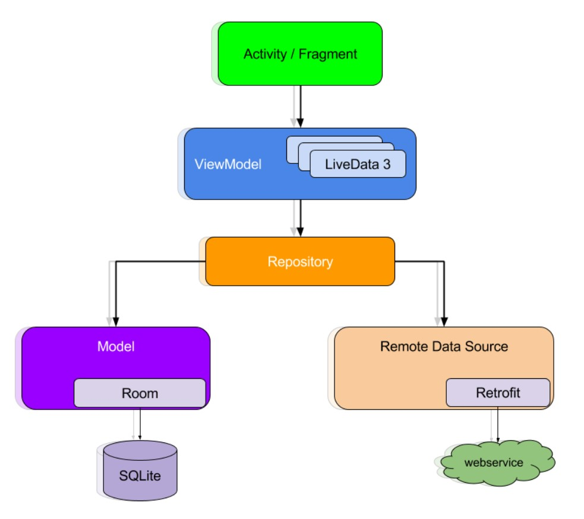
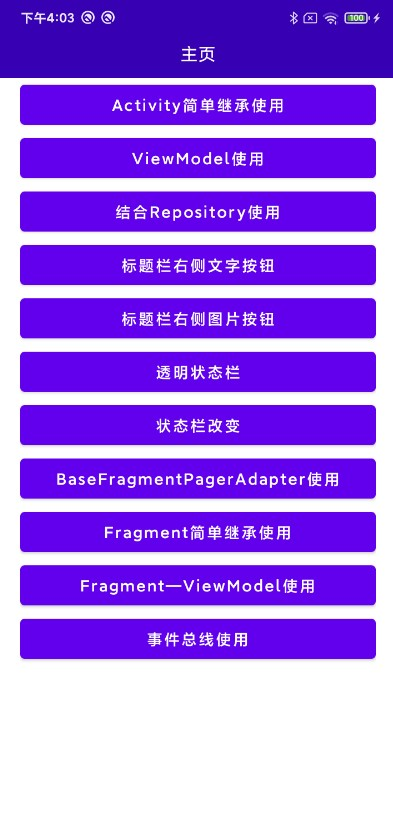

# VipBase

VipBase是一个Android端基类融合库，目前抽取了Activity,Fragment，PagerAdapter等相关的父类，也提供了和父类相关的，沉浸式状态栏，统一的标题栏，事件消息分发总线等功能，无第三方依赖，都是Android原生的代码封装，请放心使用。

有了这个基类库，可以大大缩短的您的业务开发时间，可以统一所有的页面代码书写方式，让架构模式简单化，让业务代码清晰化，和目前主流的MVVM架构模式，完美契合，您只关心业务开发，其他的交给VipBase。

#### MVVM架构图




## VipBase快速使用

1、在你的根项目下的build.gradle文件下，引入maven。

```groovy
allprojects {
    repositories {
        maven { url "https://gitee.com/AbnerAndroid/almighty/raw/master" }
    }
}
```
2、在你需要使用的Module中build.gradle文件下，引入依赖。当前版本号：1.0.3

```groovy
dependencies {
    implementation 'com.vip:base:1.0.3'
}
```

## VipBase功能使用

大家可以看源码中的app模块，里面有每个功能使用的详细介绍,或者直接点击下面对应的查看。

### Application中初始化

每个项目的不同，页面和顶部状态栏也是不一样的，在基础库中父类库中给出了一个全局初始化的方法，大家可以根据自己项目的实际主题进行全局初始化，初始化尽量提前，可在Application里onCreate方法里进行。

```kotlin

class App : Application() {
    override fun onCreate() {
        super.onCreate()
        BaseConfig.apply {
            actionBarBg = R.color.base_color_272F3E
            titleColor = R.color.base_color_ffffff
            statusBarColor = R.color.base_color_272F3E
            statusBarDarkMode = false
        }
    }
}

```

**初始化相关属性介绍（根据实际需要，选择性使用）**

|  参数  |  类型 |  说明  |
|  ----  |  ----  |  ----  |
| statusBarColor	| int	| 状态栏背景颜色  |
| statusBarDarkMode	| boolean	| 状态栏文字颜色  |
| actionBarHeight	| int	| ActionBar的高度  |
| actionBarBg	| int	| ActionBar的背景颜色  |
| titleColor	| int	| ActionBar 中间title的颜色  |
| titleSize	| float	ActionBar | 中间title的大小  |
| leftIcon	| int	| 左侧的图标，一般是返回图片  |
| leftIconWidth	| int	| 左边图片的宽度  |
| leftIconHeight	| int	| 左边图片的高度  |
| leftIconMarginLeft	| int	| 左边图片距离左边的距离  |

|  相关功能  |  概述  |  点击查看使用方式  |
|  ----  |  ----  |  ----  |
|  BaseActivity  |  逻辑比较简单的Activity可以继承此类  |[查看](README_ACTIVITY.md)|
|  BaseVMActivity  |  使用ViewModel的Activity可以继承此类  |[查看](README_ACTIVITYVM.md)|
|  BaseFragment  |  逻辑比较简单的Fragment可以继承此类  |[查看](README_FRAGMENT.md)|
|  BaseVMFragment  |  使用ViewModel的Fragment可以继承此类  |[查看](README_FRAGMENTVM.md)|
|  BaseViewModel  |  ViewModel继承此类  |[查看](README_VIEWMODEL.md)|
|  FragmentPagerAdapter |  PagerAdapter父类结合TabLayout和ViewPager使用  |[查看](README_PAGERADAPTER.md)|
|  StatusBar  |  状态栏工具类，可以实现沉浸式，透明等  |[查看](README_STATUS.md)|
|  ActionBarView  |  自定义的标题栏  |[查看](README_BAR.md)|
|  LiveDataBus |  事件消息总线  |[查看](README_BUS.md)|


## VipBase相关功能Demo效果图



## 注意事项

```

如遇到 Can't make a decor toolbar out of 问题
解决方式：您的Theme主题,请设置NoActionBar相关的主题即可

```

## 欢迎关注作者

微信搜索【Android干货铺】，或扫描下面二维码关注，查阅更多技术文章！


## License

```
Copyright (C) AbnerMing, VipBase Open Source Project

Licensed under the Apache License, Version 2.0 (the "License");
you may not use this file except in compliance with the License.
You may obtain a copy of the License at

     http://www.apache.org/licenses/LICENSE-2.0

Unless required by applicable law or agreed to in writing, software
distributed under the License is distributed on an "AS IS" BASIS,
WITHOUT WARRANTIES OR CONDITIONS OF ANY KIND, either express or implied.
See the License for the specific language governing permissions and
limitations under the License.
```


