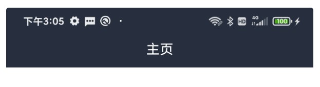
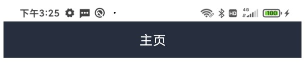
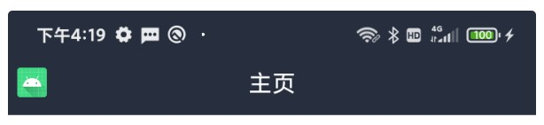
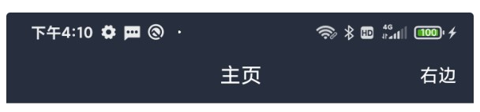
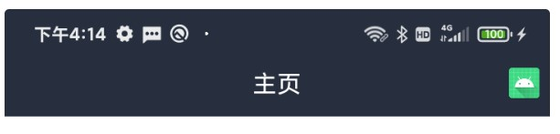

# BaseActivity

## 具体使用(举例)

### 1、新建xml布局

```xml

<?xml version="1.0" encoding="utf-8"?>
<layout xmlns:android="http://schemas.android.com/apk/res/android">
  
  <data>
    
  </data>
  
  <androidx.constraintlayout.widget.ConstraintLayout
       android:layout_width="match_parent"
       android:layout_height="match_parent">
    
  </androidx.constraintlayout.widget.ConstraintLayout>
</layout>

```
### 2、新建Activity页面

```kotlin

class TestActivity : BaseActivity<ActivityTestBinding>(R.layout.activity_test) {
    
    override fun initData() {
        //初始化数据
    }
}

```

### 设置标题

父类当中封装了一套ActionBar，包含了常见的左边返回，中间标题，右边按钮的形式，如何设置一个标题呢？可以调用下面的方法，可在初始化方法中进行调用。

```kotlin

    override fun initData() {
        //设置标题
        setBarTitle("主页")
    }

```

效果如下：



### 设置状态栏

顶部状态栏的颜色及背景需要根据项目的主题进行设置，除了在全局初始化之外，也可以单独的给某一个页面进行设置。

设置背景颜色及底部文字颜色，通过调用setDarkTitle即可，setDarkTitle是setBarTitle方法的基础上，新增了两个参数，第一个参数是，底部文字颜色，一共是两种，黑色和白色，true就是黑色，false就是白色；第二个参数就是状态栏的背景颜色，可以根据实际的UI效果，设置对应的颜色。

```kotlin
setDarkTitle(true, R.color.base_color_ffffff, "主页")

```

效果：

以上的代码是设置白色背景颜色，黑色文字颜色。



透明状态栏

参数是状态栏文字颜色

```

translucentWindow(false)

```

传递布局xml

继承父类之后，子类需要传递自己的xml，在上边的例子中，可以在括号里进行传递，如下：

```kotlin

class TestActivity : BaseActivity<ActivityTestBinding>(R.layout.activity_test) {
    
    override fun initData() {
        //初始化数据
    }

}

```

也可以通过getLayoutId来进行传递

```kotlin
    override fun getLayoutId(): Int {
        return R.layout.activity_main
    }

```

注意：这两种方式都可以进行传递xml，一是为了方便大家使用，二是为了解决navagation和Fragment一起使用时造成的一个bug。

获取ActionBarView

很多页面都需要来定义特殊的左边和右边按钮，base库中也给大家封装好了一套，大家可以按照实际的需求进行调用。

```kotlin

getActionBarView()

```

**设置左边** 

左边一般就是一个返回的图标，大家可以通过下面的方式进行添加。

```kotlin

          getActionBarView().apply {
            //设置左边
            setBarLeftIcon(R.mipmap.ic_launcher, 10, 50, 50)

            setOnLeftClickListener {
                //左边的点击事件
                
            }
        }

```

setBarLeftIcon方法总共四个参数，如下

|  参数  |  类型 |  说明  |
|  ----  |  ----  |  ----  |
| icon	| int	| 图标 |
| l	| int	| 距离左边的距离 |
| w	| int	| 图片的宽 |
| h	| int	| 图片的高 |

**效果** 




**设置右边**

文字设置（意思就是右边是一个文字）

通过getRightMenu拿到TextView，后续你想设置什么属性自己设置就行了，比如颜色，大小，点击操作等。

```kotlin

 getActionBarView().apply {
            //获取TextView
            val rightMenu = getRightMenu("右边")
            //设置文字颜色
            rightMenu.setTextColor(ContextCompat.getColor(context, R.color.base_color_ffffff))
            //设置其他属性 比如 文字大小  点击操作等
            
            //右边按钮的点击操作
            setOnRightClickListener {

            }
        }

```

效果



图片设置（右边是一个图片）

图片的话直接传一个Drawable即可，可以通过setBarRightParams这个方法进行设置宽和高以及距离右边的边距。

```kotlin
 getActionBarView().apply {
            //获取TextView
            getRightMenu(ContextCompat.getDrawable(context,R.mipmap.ic_launcher)!!)
            //设置距离右边的距离及宽和高
            setBarRightParams(10, 50, 50)

            //右边按钮的点击操作
            setOnRightClickListener {

            }
        }

```

效果



注：ActionBarView的具体属性，还请参照自定义View中的ActionBarView介绍。


## License

```
Copyright (C) AbnerMing, VipBase Open Source Project

Licensed under the Apache License, Version 2.0 (the "License");
you may not use this file except in compliance with the License.
You may obtain a copy of the License at

     http://www.apache.org/licenses/LICENSE-2.0

Unless required by applicable law or agreed to in writing, software
distributed under the License is distributed on an "AS IS" BASIS,
WITHOUT WARRANTIES OR CONDITIONS OF ANY KIND, either express or implied.
See the License for the specific language governing permissions and
limitations under the License.
```


