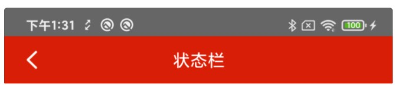
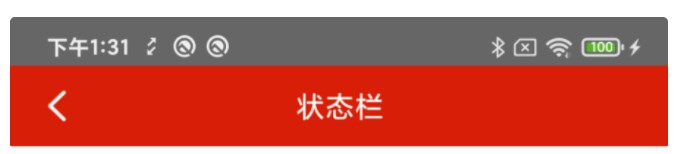

# StatusBar

## 结合Base使用

设置状态栏

代码

```kotlin

setDarkTitle(
                false,
                R.color.color_666666, "状态栏"
            )

```

参数

|  参数  |  类型 |  概述  |
|  ----  |  ----  |  ----  |
|  dark	|  Boolean 	|  状态栏文字颜色是黑色和白色  |
|  color	|  Int	 |  状态栏颜色  |
|  title	|  String	 |  标题栏颜色  |

透明状态栏

代码 (状态栏文字颜色是黑色和白色)

```kotlin
translucentWindow(false)
```

## 独立使用

改变状态栏背景

```kotlin

statusBarColor(ContextCompat.getColor(this, R.color.color_666666))

```
效果



改变状态栏文字颜色为白色

```kotlin
darkMode(false)
```

效果



透明状态栏

```kotlin

immersive(0, true)

```

## License

```
Copyright (C) AbnerMing, VipBase Open Source Project

Licensed under the Apache License, Version 2.0 (the "License");
you may not use this file except in compliance with the License.
You may obtain a copy of the License at

     http://www.apache.org/licenses/LICENSE-2.0

Unless required by applicable law or agreed to in writing, software
distributed under the License is distributed on an "AS IS" BASIS,
WITHOUT WARRANTIES OR CONDITIONS OF ANY KIND, either express or implied.
See the License for the specific language governing permissions and
limitations under the License.
```


